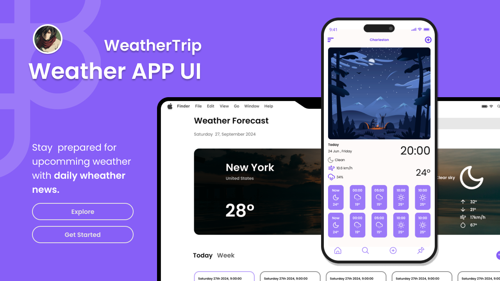
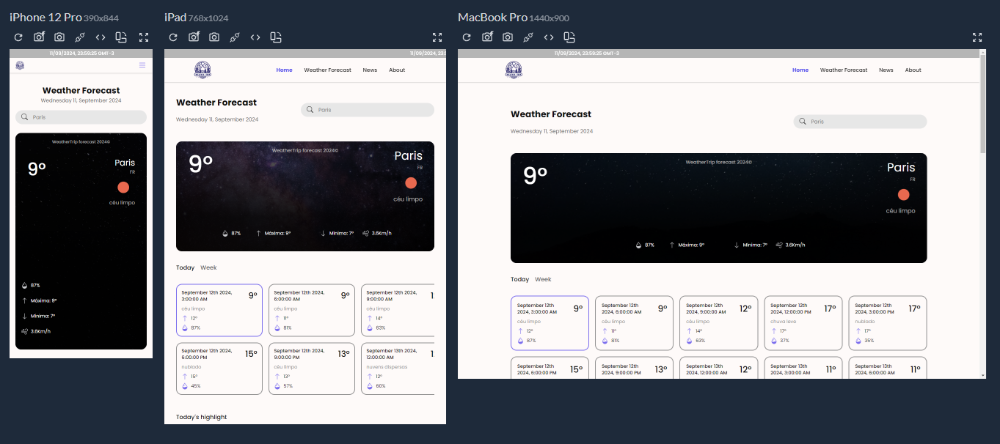

# WeatherTrip

<div align="left">
  
  
  
  
  
  
  
</div>

###


<br/>

> WeatherTrip is a real-time weather forecast application. Using the OpenWeather API Current weather data API and 5 day / 3 hour Forecast API, the website integrates real-time weather conditions from any city in the world, as well as the conditions for the next 5 days (every 3 hours)

## 🚀 Instalando WeatherTrip

Para instalar o WeatherTrip:

Windows:

```
git clone https://github.com/Joaommsp/weatherTrip-weatherApp.git
```

```
cd weatherTrip-weatherApp
```

```
npm i
```

```
npm run dev
```

## ✏️ Protótipo e Design

<p>Confira o design do projeto feito no Figma

<a  href="https://www.figma.com/design/mMFm46yUV78YJ5LMcZjA0w/WeatherTrip-Weather-App?node-id=169-1054&t=YyeMRWpSUsBYGumw-1" >
  
</a>

> Clique na imagem para ser encaminhado

## 💻 Um pouco do projeto


## 📱 Responsividade

<p>Todo o conteúdo do site se adapta a diferentes tamanhos de tela</p>




## 🪄 APIs utilizadas


## ⭐ Metas

- [x] Uma página viva e elegante
- [x] Integração das APIs
- [x] Design Responsivo
- [x] Deploy no Vercel

## 🔗 Deploy

Clique e acesse o projeto

<div align="left">
  <a href="https://weather-trip-weather-app.vercel.app/"></a>
</div>

## ⚠️ Importante

<p>Para utilizar a NEWS API fora do ambiente de desenvolvimento (localhost) é necessário possuir assinatura , por isso no deploy utilizei dados mockados, utilize o projeto em local para ver a api em utilização 👌 </p>

## 🤓 Me acompanhe para mais projetos
